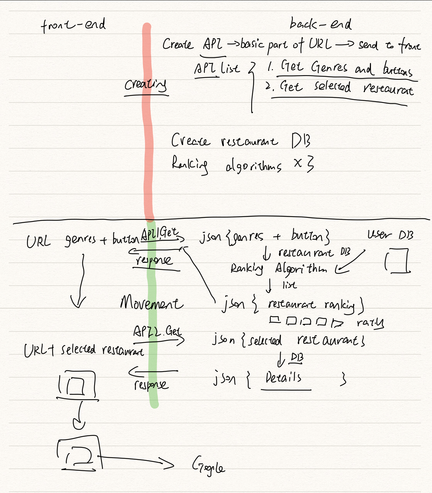

groulette_backend

This is the backend part of groulette. 

# Groulette

*A Web Application that Helps People Choose Food Randomly.*

**Language:** Python, React, SQL

**Framework:** Django

**Main Contents:** A web application that uses roulette to determine where to go for dinner or lunch.

**Goal:**
1. Choose Genre, Price, Rating ⇨ Create Roulette ⇨ Turn ⇨ Display the Restaurant.
2. Roulette is a random selection of 10 or so restaurants that match your criteria.
3. Roulette will create a roulette for each of the 10 or so restaurants that match your criteria.
4. Select 3 lists: "Dangerous", "Normal", and "Recommends".
5. Delete the stores you don't like. 
6. Change the roulette for each customer's past records.

**Diagrams:**
*Full-Stack Diagram:*

*Backend Diagram:*

### The description for the files.

restaurantDatabase.py: Create a database(SQLite) to store the restaurant data.

restaurantDatabaseInsert.py: insert data into database(SQLite)

getRestaurantJSON.py: got the data(JSON) from GoogleMapAPI and use.

getRestaurantJSON_Morethan20: got the data from GoogleMapAPI (the number of restaurant is more than 20, so we need to use the PageToken)